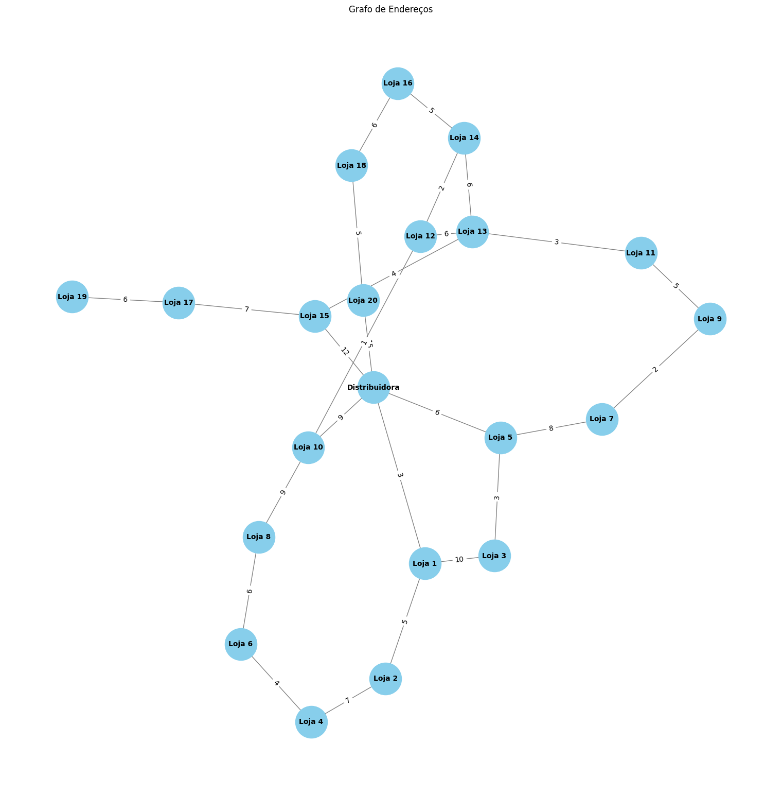

# 🔍 Módulo de Busca — Projeto Rede Âncora

Este repositório contém a **parte de busca inteligente** do projeto da **Rede Âncora**, voltado à criação de um sistema para mecânicos localizarem e receberem peças automotivas de forma eficiente. Essa implementação faz parte da disciplina de **Programação Dinâmica**, e aborda algoritmos de ordenação, seleção, sugestões de busca e otimização de caminhos com grafos.

Este módulo representa o sistema de busca e logística de entregas, e será integrado futuramente ao sistema completo da Rede Âncora, que será composto por:
- 🧩 Backend em Java, responsável por integrar os módulos e tratar os dados reais;
- 📱 Frontend com foco em experiência mobile para mecânicos;
- 📦 Este repositório: lógica de busca e roteamento, desenvolvida em Python.

---

### [1 - Sprint 3 (Ordenação e Sugestões)](./sprint3.ipynb)

Nesta etapa, foi implementada a lógica de busca e ordenação de peças com algoritmos eficientes de Programação Dinâmica.

#### **Funcionalidades incluídas:**
- Ordenação crescente e decrescente utilizando:
  - Merge Sort;
  - Quick Sort.
- Ordenação parcial:
  - Exibição dos k-maiores e k-menores valores de um atributo.
- Sistema de sugestões automáticas:
  - Recomendações com base no prefixo digitado pelo usuário.

---

### [2 - Sprint 4 (Grafos e Otimização de Entregas)](./sprint4.ipynb)

Foco na simulação logística, utilizando grafos para encontrar os caminhos mais curtos entre a distribuidora e os endereços de entrega.

#### **Funcionalidades incluídas:**
- Representação da distribuidora e das lojas em um grafo ponderado com pesos em quilômetros;
- Cálculo do menor caminho entre dois pontos com o algoritmo de Dijkstra.

**Imagem do Grafo** 
OBS: Como o grafo possui 20 nós, fica difícil representá-lo visualmente. Tentamos nosso melhor :(

---

### 3 - Instalação e Execução

Nesse projeto, foram utilizadas as bibliotecas networkx e matplotlib.pyplot de Python. Para conseguir rodá-lo, tenha certeza de que essas bibliotecas estão instaladas na sua máquina. Siga as instruções:
- Clone o repositório (git clone https://github.com/CavMCarolina/Challenge-Dynamic.git);
- Instale as dependências (pip install networkx matplotlib);
- Execute os Notebooks.

---

### 👥 Integrantes do Grupo:

#### **Este módulo foi desenvolvido por:**
- Beatriz Silva, 553455;
- Carolina Machado, 552925;
- Edson Leonardo, 553737;
- Eduardo Mazelli, 553236;
- Nathan Uflacker, 553264.
